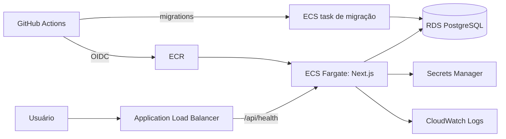

# Reserva de Salas

Sistema interno para reservar salas de reunião, com regras de reserva e permissões validadas no servidor.

## Como rodar

Pré-requisito: Node 22 (versão em `.nvmrc`; `engines` pede `>=22.12 <23`).

```bash
npm install
npm run setup   # cria o .env a partir do .env.example, aplica as migrations e roda o seed
npm run dev     # http://localhost:3000
```

O seed cria 6 salas, 4 recursos (projetor, videoconferência, quadro branco e TV) e 3 reservas futuras. Não há senha: a tela `/sign-in` lista os usuários e você escolhe com quem entrar.

| Usuário      | Papel | O que consegue fazer                                               |
| ------------ | ----- | ------------------------------------------------------------------ |
| Ana Souza    | Comum | Ver e filtrar salas, reservar, ver e cancelar as próprias reservas |
| Bruno Lima   | Comum | O mesmo que a Ana                                                  |
| Carla Mendes | Admin | O mesmo, mais criar, editar e desativar salas em `/admin/rooms`    |

Variáveis de ambiente (`.env.example`): `DATABASE_URL` (SQLite, `file:./dev.db`) e `BUSINESS_TIMEZONE` (`America/Sao_Paulo`).

Outros scripts: `npm run lint`, `npm run typecheck`, `npm test`, `npm run format:check`, `npm run build` e `npm start`.

## Funcionalidades

- **SALA-1:** listagem de salas ativas com filtro por capacidade mínima e recursos, com o estado na URL.
- **SALA-2:** reserva de sala com a ocupação do dia e aviso de conflito antes do envio.
- **SALA-3:** "Minhas reservas" (próximas e anteriores) e cancelamento das próprias reservas.
- **SALA-4:** admin de salas: listar todas, criar, editar e desativar.
- **SALA-6:** duração máxima por sala, editada no admin (15 min a 12 h) e exibida no card e na tela de reserva.

## Stack e por quê

| Tecnologia                                              | Motivo                                                                                 |
| ------------------------------------------------------- | -------------------------------------------------------------------------------------- |
| Next.js (App Router, Server Components, Server Actions) | Front e back no mesmo projeto, sem API intermediária para manter                       |
| TypeScript (`strict`, `noUncheckedIndexedAccess`)       | Erros de tipo e acessos indefinidos aparecem na compilação                             |
| Prisma 7 + SQLite (`@prisma/adapter-better-sqlite3`)    | Migrations versionadas e zero infraestrutura: roda local e no CI sem serviços externos |
| Zod                                                     | Os mesmos schemas validam no servidor e informam o formulário                          |
| `date-fns` + `@date-fns/tz`                             | Regras de calendário no fuso de negócio, independente do fuso do servidor              |
| Tailwind CSS + shadcn/ui (Radix) + Lucide               | Componentes acessíveis, com o código no repositório                                    |
| Vitest                                                  | Testes unitários e de integração contra um SQLite real                                 |

## Arquitetura

```
src/app/(app)/**        páginas (Server Components): leem searchParams com Zod e chamam services
src/app/actions/*.ts    Server Actions: requireUser/requireAdmin → Zod → service → ActionResult
src/app/api/health      único endpoint HTTP (health check)
src/server/auth.ts      getCurrentUser, requireUser, requireAdmin (cookie httpOnly)
src/server/services/*   transações, checagens de dono/permissão e consultas Prisma
src/domain/*            regras puras: sem Next, sem Prisma, sem relógio
src/schemas/*           schemas Zod compartilhados
src/components/**       UI (components/ui = shadcn gerado)
```

A dependência vai sempre para dentro: páginas → actions → services → `domain/` e Prisma. Componentes não importam nada de `server/`, e todo arquivo em `server/` começa com `import "server-only"`.

`domain/` é puro: não importa Next nem Prisma, e o instante atual (`now`) chega como parâmetro. Assim as regras de reserva são testadas com datas fixas, sem banco e sem `vi.useFakeTimers`, e o mesmo `overlaps` roda no servidor e na prévia de conflito do formulário.

Fluxo de uma reserva:

1. A página `/rooms/[id]/reserve` carrega a sala ativa e os horários ocupados do dia, sem título e sem dono.
2. O formulário mostra o conflito antes do envio com a mesma função `overlaps` do domínio. O botão continua habilitado, porque quem decide é o servidor.
3. `createReservationAction` chama `requireUser()`: o usuário vem do cookie, nunca do formulário.
4. Zod valida os campos, e a data e as horas são convertidas do fuso de negócio para UTC.
5. `createReservation` abre uma única `prisma.$transaction`: confere a sala, aplica as regras do domínio, procura conflito e faz o INSERT.
6. Uma violação de regra vira `DomainError` e volta como `ActionResult` com mensagem em português. Um erro inesperado é logado em JSON e volta como `INTERNAL_ERROR`, sem stack trace.
7. No sucesso, a action revalida as páginas afetadas e redireciona para `/me/reservations?created=1`, que mostra o aviso.

## Regras de reserva

Criar uma reserva, nesta ordem, dentro da mesma transação:

1. A sala existe e está ativa: `ROOM_NOT_FOUND`, `ROOM_INACTIVE`.
2. O término é depois do início: `INVALID_RANGE`.
3. O início não está no passado (`startsAt < now`): `IN_THE_PAST`.
4. A duração tem pelo menos 15 minutos e no máximo o limite da sala (`maxBookingMinutes`, de 15 a 720, padrão 240), em minutos exatos: `DURATION_TOO_SHORT`, `DURATION_TOO_LONG`. A mensagem cita o limite da sala.
   - **4b.** Só de segunda a sexta (`NOT_A_BUSINESS_DAY`), com início a partir de 08:00 e término até 20:00 do mesmo dia (`OUTSIDE_BUSINESS_HOURS`). Terminar às 20:00 em ponto é permitido. Tudo é avaliado no fuso de negócio, nunca no fuso do processo. Feriados ficam fora do escopo.
5. Não há sobreposição com reservas ativas da mesma sala, com intervalos semiabertos `[início, fim)`. Reservas encostadas (09–10 e 10–11) são permitidas, e canceladas não bloqueiam: `ROOM_CONFLICT`. A mensagem mostra o horário ocupado, nunca quem reservou.
6. Falha de concorrência do SQLite durante a transação: `TRY_AGAIN`.

Cancelar uma reserva:

1. A reserva existe: `NOT_FOUND`.
2. Só o dono cancela, inclusive quando o usuário é admin: `FORBIDDEN`. O dono é checado antes do status, para que outro usuário não descubra o estado da reserva alheia.
3. A reserva está ativa: `ALREADY_CANCELLED`.
4. A reserva ainda não começou (`startsAt <= now` é rejeitado): `ALREADY_STARTED`.

O cancelamento é lógico (`status = CANCELLED`, `cancelledAt`). Nenhuma reserva é apagada.

Administrar salas:

- Só admin: `FORBIDDEN` no serviço; páginas e actions respondem 404.
- O nome é único: `NAME_TAKEN`, exibido no campo nome.
- Um recurso fora do catálogo é rejeitado: `VALIDATION_ERROR`.
- Editar uma sala inexistente: `ROOM_NOT_FOUND`.
- Salas não são excluídas, só desativadas. Uma sala desativada some da listagem e não aceita novas reservas; as reservas que já existem continuam valendo.

## Decisões

Resumo das decisões tomadas onde o enunciado deixa margem. A lista completa, com todos os motivos, está em [docs/DECISIONS.md](docs/DECISIONS.md).

| Tema                                | Decisão                                                                        | Motivo                                                                        |
| ----------------------------------- | ------------------------------------------------------------------------------ | ----------------------------------------------------------------------------- |
| Fuso                                | Regras no fuso de negócio (`BUSINESS_TIMEZONE`); banco em UTC                  | O servidor de produção roda em UTC; sem fuso explícito as regras erram em 3 h |
| Reservas encostadas                 | Permitidas (`[início, fim)`)                                                   | Comportamento esperado de qualquer agenda                                     |
| Cancelamento                        | Lógico, só pelo dono (inclusive para admin) e antes do início                  | Mantém o histórico; o enunciado diz "apenas as próprias"                      |
| Excluir sala                        | Não existe; o admin desativa                                                   | Exclusão quebraria o histórico de reservas                                    |
| Desativar sala com reservas futuras | As reservas continuam valendo                                                  | Nenhuma regra pedida; o dono ainda pode cancelar                              |
| Recursos                            | Catálogo fixo no seed; o filtro exige todos os marcados                        | CRUD de recursos não foi pedido                                               |
| Horários na tela                    | Início 08:00–19:45, término 08:15–20:00; servidor aceita qualquer minuto       | Espelha o horário comercial sem inventar granularidade                        |
| Dia útil                            | Segunda a sexta, 08:00–20:00 no fuso de negócio; feriados ficam fora do escopo | Feriados exigiriam um calendário externo                                      |
| Privacidade                         | Conflito e ocupação do dia mostram só o horário, nunca o dono                  | Evita vazamento de dados entre usuários                                       |
| `/admin` para não-admin             | 404                                                                            | Não revela que a área existe                                                  |
| Filtros e datas inválidos na URL    | Ignorados (filtro) ou trocados por hoje (data)                                 | Link editado à mão não vira tela de erro                                      |
| Avisos de sucesso                   | Redirect com `?created=1`/`?updated=1`; toast no cliente ao cancelar           | Toast disparado antes de um `redirect()` se perde na navegação                |
| Backend                             | Next.js full stack, sem backend separado; único endpoint é `/api/health`       | Sem consumidor externo; os serviços isolados permitem expor REST depois       |
| Concorrência                        | Checagem de conflito e INSERT na mesma transação                               | SQLite serializa escritas; em Postgres seria uma exclusion constraint         |
| Identidade                          | Seletor "entrar como" com cookie httpOnly                                      | O enunciado dispensa login real; trocar altera só `getCurrentUser`            |

## Segurança

- **Toda Server Action é um endpoint público.** A primeira linha de cada uma é `requireUser()` ou `requireAdmin()`. `userId`, papel e dono nunca vêm do cliente: o usuário sai sempre de `getCurrentUser()`.
- **Admin é checado em camadas:** no layout `app/(app)/admin/layout.tsx`, em cada página admin e em cada action admin. O serviço repete a checagem (`FORBIDDEN`), o que protege qualquer outro chamador. Layouts não re-renderizam em toda navegação, por isso a checagem só no layout não bastaria.
- **Proxy não é barreira.** O projeto não usa proxy/middleware para autorizar: Server Actions são requisições POST que podem chegar sem passar pelas mesmas rotas de uma página, e um matcher mal configurado deixa caminhos de fora. A autorização fica onde o dado é lido ou alterado.
- **Erros:** o cliente recebe só `code` e uma mensagem curta. O detalhe fica no log do servidor, em JSON com action, userId e código.
- **Limitação da identidade simulada:** não há autenticação. Qualquer pessoa com acesso à aplicação escolhe qualquer usuário em `/sign-in`, inclusive o admin, e o cookie guarda só o id do usuário, sem assinatura. Isso atende ao enunciado, mas não serve para produção: com login real, só `getCurrentUser` muda.

## Testes

```bash
npm test
```

- **Regras de domínio** (`tests/unit/reservation-rules.test.ts`): intervalo inválido, início no passado, duração mínima de 15 minutos e máxima pelo limite de cada sala, fim de semana e horário fora de 08:00–20:00 (inclusive uma sexta 19:30–20:00 em São Paulo, que é 22:30 em UTC), e `overlaps` em todos os casos (parcial no início e no fim, contido, englobando, encostado antes e depois).
- **Sobreposição contra o banco** (`tests/integration/reservation-service.test.ts`): conflitos rejeitados, reserva encostada aceita, cancelada não bloqueia, sala inativa rejeitada, limite de duração da sala e horário comercial aplicados na criação, e a mensagem de conflito sem o dono.
- **Permissão de cancelamento:** o dono cancela; outro usuário e o admin recebem `FORBIDDEN`, e a reserva continua ativa; reserva cancelada ou já iniciada é rejeitada.
- **Admin de salas** (`tests/integration/room-service.test.ts`): usuário comum recebe `FORBIDDEN` ao criar e ao editar, e nada muda no banco; nome duplicado gera `NAME_TAKEN`; sala desativada some da listagem.
- **Fuso, filtros e schemas:** conversões entre o fuso de negócio e UTC, leitura dos filtros da URL e validação do formulário de sala.

Os testes de integração usam um SQLite real (`test.db`), criado pelas mesmas migrations da aplicação e limpo entre os testes. O Prisma não é mockado, e `now` é sempre injetado.

Os testes rodam com `TZ=UTC`, definido em `vitest.config.mts` (funciona em qualquer sistema operacional, sem `cross-env`). O servidor de CI e o de produção rodam em UTC: assim, qualquer regra que use o fuso do processo em vez do fuso de negócio falha no teste, e não só em produção. Um teste confere que o fuso está mesmo em UTC.

## Qualidade e CI

O workflow `.github/workflows/ci.yml` roda em todo pull request para `main` e `develop`, com o Node do `.nvmrc` e cache do npm. Os passos são: `npm ci` → criar o `.env` → `npm run lint` → `npm run format:check` → `npm run typecheck` → `npm test` → `npm run build`. O job se chama `ci`, nome estável para ser usado como check obrigatório.

## Produção na AWS

Em produção, a aplicação rodaria como container no ECS Fargate, atrás de um Application Load Balancer cujo health check chama `GET /api/health`. Esse endpoint responde 200 com o banco acessível e 503 quando não está. O SQLite daria lugar a um RDS PostgreSQL, em que a regra de sobreposição também vira uma exclusion constraint (`EXCLUDE USING gist` sobre a sala e o intervalo `[início, fim)` das reservas ativas): o banco garante a regra mesmo sob concorrência. Credenciais e `DATABASE_URL` ficam no Secrets Manager, e staging e produção ficam em contas AWS separadas. O deploy sai do GitHub Actions, que se autentica via OIDC (sem chaves de longa duração), publica a imagem no ECR e roda as migrations como uma task ECS antes do rollout do serviço. Os logs JSON da aplicação vão para o CloudWatch.



## Git flow

- `main`: produção. Cada release recebe uma tag.
- `develop`: integração.
- `feature/SALA-<n>-descricao`: uma branch por card, a partir de `develop`.
- `release/<versão>`: estabilização antes de ir para `main`.
- `hotfix/<...>`: correção urgente, a partir de `main`.

Todo merge passa por pull request, com merge commit (sem squash nem rebase), para que `main` e `develop` compartilhem os commits de release e hotfix. As mensagens seguem Conventional Commits (`feat`, `fix`, `test`, `chore`, `ci`, `docs`).

<!-- histórico de releases será completado na 1.1.0 -->

## O que ficou de fora e por quê

- **Login real e recuperação de senha:** o enunciado dispensa.
- **Feriados:** exigiriam um calendário externo.
- **Reserva recorrente, convites e notificações:** não foram pedidos, e cada um traz regras próprias.
- **Paginação da listagem de salas:** o volume é pequeno. "Anteriores" em Minhas reservas mostra só as últimas 20.
- **Rate limiting, métricas e tracing:** em produção ficariam no gateway e na infraestrutura.

## Próximos passos

- PostgreSQL com exclusion constraint para a sobreposição, mantendo a checagem na transação para dar a mensagem amigável.
- Login real (SSO/OIDC da empresa) no lugar do seletor "entrar como": só `getCurrentUser` muda.
- Notificações de reserva criada e cancelada.

## Uso de IA

O Claude Code foi usado como par de programação no planejamento, na implementação e na revisão; todo o código foi revisado e entendido pelo autor, que responde por ele.
